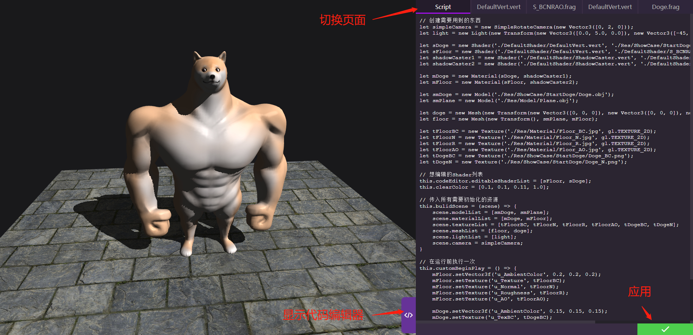
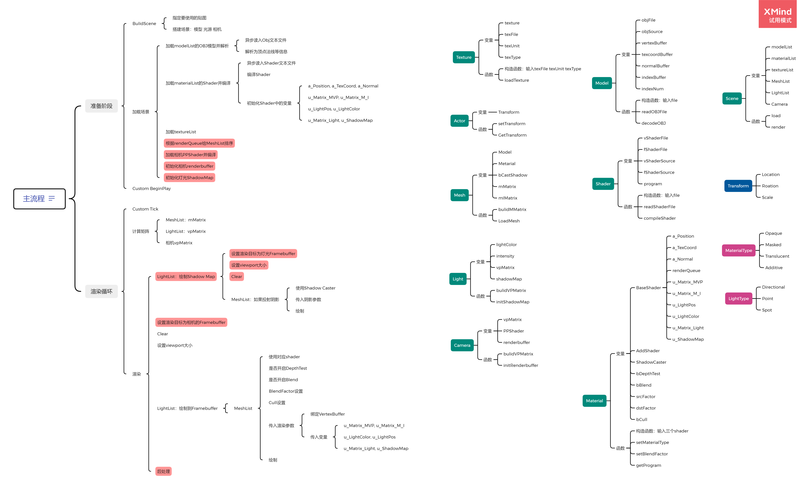

# WebGLRenderer

使用原生 JavaScript、HTML/CSS 和 WebGL 1 编写的轻量渲染器。始于 2022 年的 WebGL 学习实践，目标是展示模型、材质与实时特效，并通过 iframe 嵌入个人博客。

包含 OBJ 加载、基础光照、阴影、法线贴图、透明混合、天空盒和实验性 PBR，以及可编辑场景脚本和 Shader 的网页界面；数学与 WebGL 辅助函数来自 `cuon-*` / `webgl-*`，代码高亮使用 highlight.js。

## 运行与使用

这是静态网页项目，无需构建。在项目根目录启动 HTTP 服务，例如已安装 `http-server` 时：

```sh
http-server . -p 8080 -c-1
```

打开 [SimpleDemo](http://localhost:8080/SimpleDemo.html)。已有 HTTP 服务时直接使用其地址；模型、脚本和 Shader 通过 HTTP 加载，不要直接打开 HTML。

| 示例场景入口 | 内容 |
| --- | --- |
| [SimpleDemo.html](SimpleDemo.html) | 旋转立方体、贴图地面、法线与阴影 |
| [DogeDemo.html](DogeDemo.html) | Doge 模型、多张材质贴图与天空盒 |
| [Translucent.html](Translucent.html) | 半透明混合与绘制排序 |
| [CubeMap.html](CubeMap.html) | CubeMap 采样 |
| [PBR.html](PBR.html) | PBR 与环境光实验 |

UI上，左侧按钮展开示例列表，右下角按钮展开代码编辑器；选择 Script 或 Shader 标签，修改后点击应用。Script 会重新构建场景，Shader 会重新编译；页面内修改不会保存到磁盘。



示例场景均使用的是 SimpleRotateCamera 相机，内部实现了操作方式：左键拖动旋转视角，右键拖动或滚轮缩放。实际使用中可直接使用Camera类进行底层的操作与控制。

部署到静态站点后，可使用iframe在引用对应页面：

```html
<iframe src="/WebGLRenderer/SimpleDemo.html" width="100%" height="700" style="border:0"></iframe>
```

**项目 API 与教程：** [【WebGL】纯手写Web端渲染器及其API](https://1keven1.github.io/2022/05/10/%E3%80%90WebGL%E3%80%91%E7%BA%AF%E6%89%8B%E5%86%99Web%E7%AB%AF%E6%B8%B2%E6%9F%93%E5%99%A8%E5%8F%8A%E5%85%B6API/)。文章中也有框架搭建、阴影、法线贴图三篇教程的链接。博客与设计图可能滞后，接口以当前源码和示例为准。

## 目录与核心类

| 位置 | 职责 |
| --- | --- |
| `RendererLib/WebGLRenderer.js` | 启动、渲染循环、输入事件；同文件还包含 CodeEditor、HUD、ShowCasesPanel |
| `RendererLib/Scene.js` | 场景资源列表、加载协调、更新、排序与绘制 |
| `RendererLib/Actor.js` | Transform、Actor，以及 Mesh、Light、Camera、SimpleRotateCamera |
| `RendererLib/Model.js` | OBJ 解析、切线计算与 GPU Buffer 创建 |
| `RendererLib/Material.js` | 材质参数、渲染队列、深度/混合/剔除状态 |
| `RendererLib/Shader.js` / `Texture.js` | Shader 加载编译；2D 纹理、CubeMap 与环境贴图加载 |
| `RendererLib/FunctionLibrary.js` | 数学工具与 Vector3、Transform 扩展 |
| `RendererLib/WebGLLib/`、`RendererLib/highlight/`、`RendererLib/CSS/` | 辅助库、高亮库和界面样式 |
| `DefaultShader/` | 内置顶点与片元着色器 |
| `Res/` | 共用资源及 `ShowCase/` 下的示例专用资源 |
| 根目录 HTML / JS、`ShowCases.json` | 示例页面、场景脚本和示例列表配置 |

对象关系：`WebGLRenderer → Scene → Mesh / Light / Camera`；三者继承 Actor，拥有 Transform。`Mesh = Transform + Model + Material`；Material 持有 Base Shader 与可选的 ShadowCaster Shader，Shader 由顶点和片元程序组成。



## 渲染流程与原理

采用前向渲染，主流程位于 `WebGLRenderer.startRenderLoop()` 和 `Scene.render()`：

```text
读取场景脚本 → buildScene → 加载模型/材质/纹理、初始化阴影贴图
→ customBeginPlay（一次）
→ requestAnimationFrame 循环：
  更新 Actor 与相机 → customTick → 绘制排序 → 计算矩阵
  → 绘制光源 Shadow Map → 绘制场景到屏幕 → 更新 HUD
```

- **光照与法线：** 顶点阶段输出世界空间数据；OBJ 导入时由 UV 计算切线，片元阶段将法线贴图转换到世界空间参与光照。
- **阴影：** 从光源视角绘制深度，编码到 RGBA 纹理；主绘制比较深度判断遮挡，部分 Shader 使用九次采样的 PCF 近似。

## 添加场景与继续开发

1. 复制 `SimpleDemo.html` 和 `SimpleDemo.js`，修改 HTML 底部请求的场景 JS 路径。也可参考 [1CustomScriptTemplate.js](1CustomScriptTemplate.js)，其中相机等对象需要自行补全。
2. 创建模型、材质、贴图、Mesh、光源和相机。在 `this.buildScene(scene)` 中登记各资源列表、`meshList`、`lightList` 和 `camera`；未登记的资源不会自动加载。
3. 在 `this.customBeginPlay()` 中设置材质参数，在 `this.customTick(deltaSecond)` 中编写逐帧逻辑。
4. 用 `shader.VS.bind(shader)` / `shader.FS.bind(shader)` 填充 `this.codeEditor.editableShaderList`，指定允许编辑的 Shader。

**开发时注意：**

- 当前使用全局类和 `gl` / `canvas`，依赖 HTML 中的脚本顺序和既有 DOM 结构，尚未模块化。场景脚本由渲染器通过 `eval` 执行，不能直接当普通 `<script>` 引入。
- 资源相对路径以 HTML 页面为基准；新增示例保持在根目录最方便。重命名接口时同步示例、模板和 API 文档。
- 当前实际支持主定向光；多光源累加、点光源、聚光灯和后处理未完成。OBJ 加载器面向带法线的三角面模型，使用 16 位索引；现有纹理加载器要求宽高为 2 的整数次幂。
- 已知问题见 [0ToDoList.txt](0ToDoList.txt)。修改后至少检查相关 Demo 的画面、控制台、相机操作、脚本应用和 Shader 重新编译；目前没有自动化测试入口。
